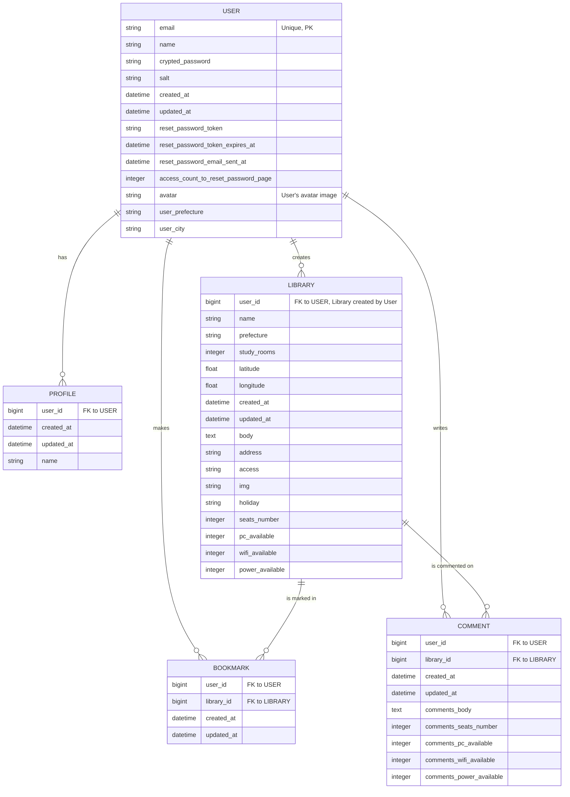

```mermaid
erDiagram

    USER {
        string email "Unique, PK"
        string name
        string crypted_password
        string salt
        datetime created_at
        datetime updated_at
        string reset_password_token
        datetime reset_password_token_expires_at
        datetime reset_password_email_sent_at
        integer access_count_to_reset_password_page
        string avatar "User's avatar image"
        string user_prefecture
        string user_city
    }

    PROFILE {
        bigint user_id "FK to USER"
        datetime created_at
        datetime updated_at
        string name
    }

    LIBRARY {
        bigint user_id "FK to USER, Library created by User"
        string name
        string prefecture
        integer study_rooms
        float latitude
        float longitude
        datetime created_at
        datetime updated_at
        text body
        string address
        string access
        string img
        string holiday
        integer seats_number
        integer pc_available
        integer wifi_available
        integer power_available
    }

    BOOKMARK {
        bigint user_id "FK to USER"
        bigint library_id "FK to LIBRARY"
        datetime created_at
        datetime updated_at
    }

    COMMENT {
        bigint user_id "FK to USER"
        bigint library_id "FK to LIBRARY"
        datetime created_at
        datetime updated_at
        text comments_body
        integer comments_seats_number
        integer comments_pc_available
        integer comments_wifi_available
        integer comments_power_available
    }

    USER ||--o{ PROFILE : "has"
    USER ||--o{ BOOKMARK : "makes"
    USER ||--o{ COMMENT : "writes"
    USER ||--o{ LIBRARY : "creates"
    LIBRARY ||--o{ BOOKMARK : "is marked in"
    LIBRARY ||--o{ COMMENT : "is commented on"
```